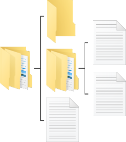

# [atet](https://github.com/atet) / [learn](https://github.com/atet/learn) / [**_raspberrypi_**](https://github.com/atet/learn/tree/master/raspberrypi)

[](#nolink)

# Introduction to Raspberry Pi (UNDER CONSTRUCTION)

* Estimated time to completion: 15 minutes.
* This quick introduction to the Raspberry Pi computer is meant to cover only the absolute necessary material to get you up and running in a minimal amount of time.
* You are here because **you want to learn how a Raspberry Pi can realistically benefit your life**.
* We will be using <a href="https://en.wikipedia.org/wiki/Bash_(Unix_shell)" target="_blank">Bash Command Line Interface (CLI)</a> to perform basic operations; advanced material is not covered here.

--------------------------------------------------------------------------------------------------

## Table of Contents

### Introduction

* [0. Requirements](#0-requirements)
* [1. Game Plan](#1-game-plan)
* [2. Installation](#2-installation)
* [3. Connection](#3-connection)
* [4. Setup](#4-setup)
* [5. Craft Server Installation](#5-craft-server-installation)
* [6. Craft Client Installation](#6-craft-client-installation)
* [7. Next Steps](#7-next-steps)

### Supplemental

* [Using Command Line Interface](#using-command-line-interface)
* [Why Raspberry Pi?](#why-raspberry-pi)
* [Other Resources](#other-resources)
* [Troubleshooting](#troubleshooting)
* [Acknowledgments](#acknowledgments)

--------------------------------------------------------------------------------------------------

## 0. Requirements

### Software

* This tutorial was developed on Microsoft Windows 10 with Windows Subsystem for Linux (WSL) using Ubuntu 18.04 LTS
* If you are using MacOS, [your Terminal program is Bash](https://en.wikipedia.org/wiki/Terminal_(macOS))
* Most Linux distributions use or can use Bash

### Hardware

[](#nolink)

* This tutorial is based on the Raspberry Pi Zero W ("wireless") which can be purchased from as little at $5-10
* Accessories: If you already have a 5V, microUSB phone charger and a microSD card (>8 GB), you're good
* Wireless internet: The PI zero W is WiFi ready, you must have access to be able to connect a new wireless device to your WiFi network with only the network name and password
   * Some networks may require additional registration for new devices, like a school or public WiFi

[Back to Top](#table-of-contents)

--------------------------------------------------------------------------------------------------

## 1. Game Plan

[Back to Top](#table-of-contents)

--------------------------------------------------------------------------------------------------

## 2. Installation

### Windows 10

* Windows Subsystem for Linux (WSL) is a fully supported Microsoft product for Windows 10, learn how to install it here: [https://docs.microsoft.com/en-us/windows/wsl/install-win10](https://docs.microsoft.com/en-us/windows/wsl/install-win10)
* Please choose Ubuntu 18.04 LTS as the distribution you use with WSL
* WSL is only available for Windows 10

### MacOS

* You do not need to install anything, [your Terminal program is Bash](https://en.wikipedia.org/wiki/Terminal_(macOS))

### Linux

* I recommend using Ubuntu 18.04 LTS


[Back to Top](#table-of-contents)

--------------------------------------------------------------------------------------------------

## 3. Connection

* We will be working on the Pi remotely and it will be a headless (no monitor/keyboard/mouse) server. 
* After a few minutes, the Pi should now be ready for connection. We will use SSH through the WSL command line interface. from your computer, we can figure out the IP address that the Pi was assigned without actually having to connect a monitor to it
   * As some may not have administrator access to their WiFi network to find the Pi's IP or a mini HDMI adapter to plug in a monitor, the following method is best

[Back to Top](#table-of-contents)

--------------------------------------------------------------------------------------------------

## 4. Setup

[Back to Top](#table-of-contents)

--------------------------------------------------------------------------------------------------

## 5. Craft Server Installation

[Back to Top](#table-of-contents)

--------------------------------------------------------------------------------------------------

## 6. Craft Client Installation

[Back to Top](#table-of-contents)

--------------------------------------------------------------------------------------------------

## 7. Next Steps

[Back to Top](#table-of-contents)

--------------------------------------------------------------------------------------------------

## Using Command Line Interface

### What is Bash?

* Bash is a command line interface (CLI) that allows you to use your operating system purely by text commands 
   * This is a huge benefit over clicking buttons in a graphical user interface **especially if you have a ton of repetitive and routine tasks**
* If you're a Windows user like I am, _unlike DOS Command Prompt that is tied to Microsoft_, Windows Subsystem for Linux finally allows some cross-compatibility with Linux and MacOS

### WARNING: CLI is very powerful

* With great power comes great responsibility; be vigilant of code you run so accidents don't happen
* If this is your first experience with using a command line interface, don't be intimidated, this is worth learning

### Welcome to CLI

* Before we dive into regular expressions, let's go over some basic commands to get around in Bash
* When you first start your command line interface (CLI), you'll typically be greeted with something similar to this:

```
atet:LAPTOP:~$ _
```
* For the sake of this tutorial, type out any commands you see after the `$` in the examples below

### Navigation

* If you're accustomed to using a graphical user interface (GUI) file explorer, just continue to think of your files and folders (a.k.a. "directories") in a tree-like structure

[](#nolink)

* If you execute the command `pwd` ("print working directory"), you'll see where you are currently in your file system

```
atet@LAPTOP:~$ pwd
/home/atet
```

* We can see what files are in your current working directory by executing `ls` ("list")

```
atet@LAPTOP:~$ ls
book.txt  new  song.mp3
```

* If you need more information about your files, you can add the flag `-l` to see more detail

```
atet@LAPTOP:~$ ls -l
total 0
-rw-rw-rw- 1 mba mba    0 Dec 21 18:39 book.txt
drwxrwxrwx 1 mba mba 4096 Dec 21 18:42 new
-rw-rw-rw- 1 mba mba    0 Dec 21 18:39 song.mp3
```

* A lot of information, but in this example we see that the file `new` is actually a directory (look all the way to the left and you see the `d`)
* If you have directories you want to navigate in and out of, you can use `cd <DIRECTORY NAME>` ("change directory") to go in and `cd ..` to go out

```
atet@LAPTOP:~$ cd new
atet@LAPTOP:~/new$ cd ..
atet@LAPTOP:~$
```

### File Management

* We only need to know four commands for file management this tutorial
* To make a new directory, use `mkdir <NEW NAME>` ("make directory")

```
atet@LAPTOP:~$ mkdir folder
atet@LAPTOP:~$ cd folder
atet@LAPTOP:~/folder$
```

* We will download an example files from my GitHub to work on, let's download one now with the program `wget`

```
atet@LAPTOP:~/folder$ wget https://raw.githubusercontent.com/atet/learn/master/regex/data/jane.txt

<A BUNCH OF WGET STATUS TEXT>

atet@LAPTOP:~/folder$ ls
jane.txt
```

* This is a short file, so we can peek at **all** the text contents using the program `cat` (don't use `cat` on big files, use `head` or `tail`)

```
atet@LAPTOP:~/folder$ cat jane.txt
Andrew_WK_-_Party_Hard.mp4
Beethoven_-_Fur_Elise.m4a
Beethoven_-_Symphony_No_6.mp3
Eddie_Murphy_-_Party_All_the_Time.mp3
LMFAO_-_Party_Rock_Anthem.mp4
Miley_Cyrus_-_Party_In_The_USA.mp4
Rick_Astley_-_Never_Gonna_Give_You_Up.m4a
```

* Let's **permanently delete** this file for now with `rm` ("remove")
   * WARNING: There will be no confirmation to delete files nor is there a concept of "recycling bin" here, be very careful with `rm`

```
atet@LAPTOP:~/folder$ ls
jane.txt
atet@LAPTOP:~/folder$ rm jane.txt
atet@LAPTOP:~/folder$ ls
atet@LAPTOP:~/folder$ _
```

[Back to Top](#table-of-contents)

--------------------------------------------------------------------------------------------------

## Why Raspberry Pi?

* **_Trust me on this one_**: There's a huge difference in your experience of learning something when the brand has sold 10+ million computers vs. a less-known (cheaper?) alternative that has only thousands of customers
* With a larger userbase bugs get fixed quicker, there's reliable community and official support, you can expect timely updates, etc.
* The Raspberry Pi Zero is relatively inexpensive, but this brand has other more powerful, more expensive computers

[Back to Top](#table-of-contents)

--------------------------------------------------------------------------------------------------

## Other Resources

Description | Link
--- | ---
 | 

[Back to Top](#table-of-contents)

--------------------------------------------------------------------------------------------------

## Troubleshooting

Issue | Solution
--- | ---
 | 

[Back to Top](#table-of-contents)

--------------------------------------------------------------------------------------------------

## Acknowledgments

1. newsCorpora.tsv is modified from NewsAggregatorDataset.zip: <a href="http://archive.ics.uci.edu/ml/datasets/News+Aggregator" target="_blank">Dua, D. and Graff, C. (2019). UCI Machine Learning Repository [http://archive.ics.uci.edu/ml]. Irvine, CA: University of California, School of Information and Computer Science.</a>

[Back to Top](#table-of-contents)

--------------------------------------------------------------------------------------------------

<p align="center">Copyright © 2019-∞ Athit Kao, <a href="http://www.athitkao.com/tos.html" target="_blank">Terms and Conditions</a></p>