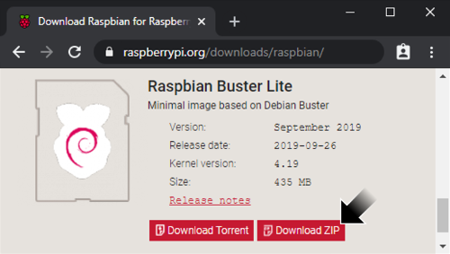
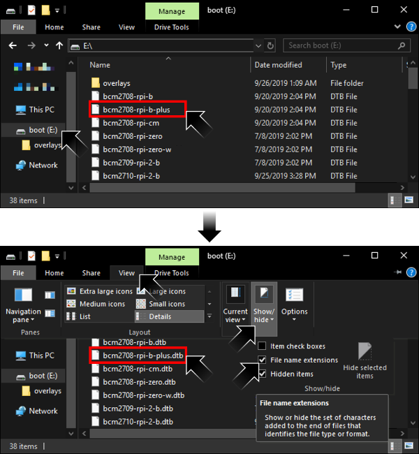
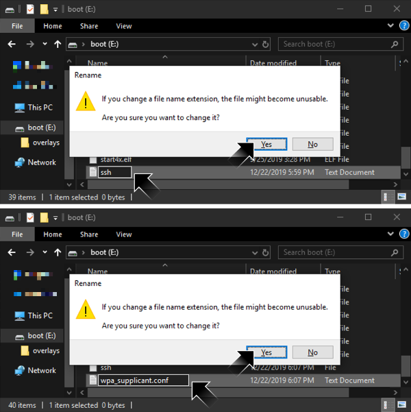

# [atet](https://github.com/atet) / [learn](https://github.com/atet/learn) / [**_raspberrypi_**](https://github.com/atet/learn/tree/master/raspberrypi)

[](#nolink)

# Introduction to Raspberry Pi

* Estimated time to completion: 15 minutes (not including waiting times for downloads and updates).
* This quick introduction to Raspberry Pi is meant to cover only the absolute necessary material to get you up and running in a minimal amount of time.
* You are here because **you want to experience a realistic use case for using single board computers (SBC) while learning fundamental IT skills**.
* We will be using a Raspberry Pi Zero W and Bash to perform basic operations; advanced material is not covered here.

--------------------------------------------------------------------------------------------------

## Table of Contents

### Introduction

* [0. Requirements](#0-requirements)
* [1. _Game_ Plan](#1-game-plan)
* [2. Installation](#2-installation)
* [3. Connection](#3-connection)
* [4. Setup](#4-setup)
* [5. Craft Server](#5-craft-server)
* [6. Craft Client](#6-craft-client)
* [7. Next Steps](#7-next-steps)

### Supplemental

* [Why Raspberry Pi?](#why-raspberry-pi)
* [Other Resources](#other-resources)
* [Troubleshooting](#troubleshooting)
* [Acknowledgments](#acknowledgments)

--------------------------------------------------------------------------------------------------

## 0. Requirements

### Software

* This tutorial was developed with Bash on Microsoft Windows 10 with Windows Subsystem for Linux (WSL) using Ubuntu 18.04 LTS
   * WSL is a fully supported Microsoft product for Windows 10, learn how to install it here: [https://docs.microsoft.com/en-us/windows/wsl/install-win10](https://docs.microsoft.com/en-us/windows/wsl/install-win10)
* If you are using MacOS, [your Terminal program is Bash](https://en.wikipedia.org/wiki/Terminal_(macOS))
* Most Linux distributions use or can use Bash; I recommend Ubuntu 18.04 LTS

### Hardware

> [](#nolink)
> 
> Raspberry Pi Zero W, a single board computer (SBC)

* This tutorial **requires the Raspberry Pi Zero W** ("wireless") which can be purchased from as little at $5-10 (computer only), you will also need:
   * Cell phone charger (5V) with micro USB
   * MicroSD card (≥8 GB)

### WiFi Network

**The Pi Zero W is WiFi ready but requires very specific WiFi settings**

1. You must be able to connect a new wireless device to your WiFi network using only the network name (a.k.a. SSID) and network password
   * Some networks may require additional registration for new devices, like a school or public hotspot
   * The network can be hidden
2. The wireless network must have disabled [**"wireless isolation"** (a.k.a. AP isolation, station isolation, or client isolation)](https://www.howtogeek.com/179089/lock-down-your-wi-fi-network-with-your-routers-wireless-isolation-option/)

[Back to Top](#table-of-contents)

--------------------------------------------------------------------------------------------------

## 1. _Game_ Plan

* Let's do something fun and setup a Craft<sup>[[1]](#acknowledgments)</sup> server to host multiple players at the same time
* Several different skills are introduced in this short project:
   1. Basic IT: Formatting disks and installing operating systems
   2. Networking: Local area networking and secure shell access
   3. System Administration: Command line interface, building from source code, and running a server

> [](#nolink)
> 
> Messing around on Craft in single player mode

[Back to Top](#table-of-contents)

--------------------------------------------------------------------------------------------------

## 2. Installation

### 2.1. Download Operating System: Raspbian Linux

* We will use a command line interface (CLI)-only Linux operating system
   * There is no graphical user interface (GUI) like Microsoft Windows
   * Your interaction with the Raspberry Pi will be completely through text commands from a different computer
* Download the latest Raspbian **Lite** image from: [https://www.raspberrypi.org/downloads/raspbian/](https://www.raspberrypi.org/downloads/raspbian/)

[](#nolink)

### 2.2. Prepare Micro SD Card

**This is the only step that can be frustrating and may take a few retries**

1. Clear everything off the SD card; delete all partitions
   * Windows: Use `diskpart` or Disk Management
2. Reformat the card
   * Windows `diskpart`: Deleting partitions here **does not reformat** the SD card
   * Windows Disk Management: Creating a new simple disk here will also reformat the SD card
3. Burn the Raspbian image onto the formatted micro SD card
   * I used Rufus Portable v3.8: [https://rufus.ie/](https://rufus.ie/)
   * If you do not format the SD card **before** this step, you may not be able to read the SD card as the `boot` drive
   * When the image burn is complete, just cancel out of Rufus

[](#nolink)

4. Access the new `boot` drive
   * **If you cannot read the card**; repeat steps 1-3
   * Show file name extensions

[](#nolink)

   * Make a new file called `ssh` (no file extension)
   * Make a new file called `wpa_supplicant.conf`

[](#nolink)

5. `wpa_supplicant.conf` settings
   * Open `wpa_supplicant.conf` with Notepad (right-click → Open with → Choose another app → Notepad)
   * Copy and paste the following, changing `<NETWORK NAME>` and `<NETWORK PASSWORD>` to match your network's and save
      * If your WiFi network is hidden, you must use the line `scan_ssid=1`

```
ctrl_interface=DIR=/var/run/wpa_supplicant GROUP=netdev
update_config=1
country=US

network={
   ssid="<NETWORK NAME>"
   scan_ssid=1
   psk="<NETWORK PASSWORD>"
   key_mgmt=WPA-PSK
}
```

[](#nolink)

6. Headless OS installation
   * **Headless** means that we will not have a monitor or keyboard attached to the Raspberry Pi Zero W and all administration of it will be remotely through command line interface (CLI)
   1. The Pi should not be powered on at this time
   2. Insert micro SD card
   3. Plug the micro USB power into the power port and the green LED should start blinking
   4. Wait for ~10 minutes while the Raspbian OS installs, configures itself, and automatically connects to your WiFi network; when it is done, the green LED should stop blinking and stay on

[Back to Top](#table-of-contents)

--------------------------------------------------------------------------------------------------

## 3. Connection

### 3.1. Determining your headless Raspberry Pi's IP address

**This may be tricky depending on your unique situation; I will describe three scenarios**

1. You have administrative access to your local network's router
   * Log into the router and determine the IP address that corresponds to the `raspberrypi` hostname (default name configured for your Raspberry Pi Zero W)
2. You **do not** have access to your network's router but have USB and HDMI adapters
   * You need an HDMI compatible TV or monitor
   * Adapters for micro USB (Male) to USB-A (Female) and Mini HDMI (Male) to HDMI (Female)

   [](#nolink)

   * Connect a USB keyboard and HDMI monitor to the Pi using the adapters
   * Login as username `pi` and password `raspberry`
   * Execute `ifconfig` and determine Pi's IP address

   ```
   $ ifconfig

   <EXAMPLE OUTPUT OF IFCONFIG>
   ```

3. You **do not** have access to your network's router or adapters
   * You can connect to you Raspberry Pi through USB: [https://www.tomshardware.com/reviews/raspberry-pi-headless-setup-how-to,6028.html](https://www.tomshardware.com/reviews/raspberry-pi-headless-setup-how-to,6028.html)
   * You have to scan your network for all IP addresses: [https://www.raspberrypi.org/documentation/remote-access/ip-address.md](https://www.raspberrypi.org/documentation/remote-access/ip-address.md)

### 3.2. Remote connection to Raspberry Pi

* We will use Bash secure shell (SSH) through the WSL command line interface
* SSH as username `pi` and password `raspberry`

```
$ ssh pi@<IP ADDRESS>

<ENTER PASSWORD>

<LOGIN MESSAGE OF THE DAY>
```

**If you successfully log in, CONGRATS! all the hard work is now done**

[Back to Top](#table-of-contents)

--------------------------------------------------------------------------------------------------

## 4. Setup

1. After logging in, we need to make a change to a location where the Pi will look for updates

```
$ sudo nano /etc/apt/sources.list
```

* Uncomment (remove '#' in front of): `deb-src http://raspbian...`
   * Press `CTRL+O` then `ENTER` to save
   * Press `CTRL+X` to exit

2. Next, we need to update everything on the Pi and install a couple new dependencies (this will take 10+ mins., time for coffee break):

```
$ sudo apt-get update && \
  sudo apt-get -y upgrade && \
  sudo apt-get -y install git python-pip cmake libglew-dev xorg-dev libcurl4-openssl-dev && \
  sudo apt-get -y build-dep glfw && \
  python -m pip install requests
```

[Back to Top](#table-of-contents)

--------------------------------------------------------------------------------------------------

## 5. Craft Server

1. Download the files for running a Craft server from GitHub (~15 MB)

```
$ cd ~ && \
  git clone https://github.com/fogleman/Craft.git && \
  cd ~/Craft && \
  cmake .
```

2. We can now build the Craft program to run on the specific Raspberry Pi Zero W hardware (this will take ~10 mins., time for coffee break #2)

```
$ make && \
  gcc -std=c99 -O3 -fPIC -shared -o world -I src -I deps/noise deps/noise/noise.c src/world.c
```

3. Start server
   * The server hosts a persistent, shared world for users (clients) to connect to and play
   * Remember the IP address for the Pi, this IP is the address that clients will connect to within your local area network (LAN)
   * Once you run the line below, the server display any output as events happen in the game world (players connecting, logging out, etc.)
      * You can stop the server by pressing `CTRL+C`

```
$ python server.py
```

[Back to Top](#table-of-contents)

--------------------------------------------------------------------------------------------------

## 6. Craft Client

### 6.1. Registering an account

* Even if we roll our own sever here, we need to register an account at the author's website to make changes in the multiplayer world: https://craft.michaelfogleman.com/

> "Why register?
>
> You can play on most game servers anonymously. **However, without registering you will not be able to make changes in most areas of the world**. After you are registered, game server admins can grant you various types of permissions."

* After you register and verify your email address, log back into https://craft.michaelfogleman.com/ and make an Identity Token, it should look like this:

```
/identity <USERNAME> 0123456789abcdef0123456789abcdef
```

* **Highlight the line and CTRL+C** (pressing the copy to clipboard didn't work for me to paste in the game)
   * NOTE: You can only see and copy this key once, when you close the window or logout, you will have to make another key

[](#nolink)

### 6.2. Download Craft client

* Download the Craft client for Windows or MacOS here: https://www.michaelfogleman.com/projects/craft/
   * This is a "portable" program; nothing needs to be installed, just extract the ZIP file
* Run `craft.exe`
* Once the game starts, press "T" and CTRL+V to paste in your Identity Token and press ENTER
* Press "T" and enter `/online <SERVER IP>` to connect to your Raspberry Pi Zero Craft server
   * Once on the server, you should automatically be connected as your account
   * If it says you are a "guest", you must re-login: `/login <USERNAME>`

[](#nolink)

### 6.3 Playing Craft

Button | Action
--- | ---
`W`, `A`, `S`, `D` | Movement
Left-Mouse | Destroy block
Right-Mouse | Create block
Mouse-Wheel | Cycle through block types
CTRL+Right-Mouse | Create light source
`T` | Chat
`/` | Command: Chat but with `/` added
ESCAPE | Mouse control back to OS (to close or maximize/minimize Craft window)
More controls | https://github.com/fogleman/Craft#controls

[Back to Top](#table-of-contents)

--------------------------------------------------------------------------------------------------

## 7. Next Steps

**We touched on a bunch of different IT tasks here; learning to be a self-sufficient "Helpdesk" just takes a lot of experimenting and DIY projects like this**

[](#nolink)

* Have other people join in at your home network!
   * What we've setup here, only computers within your local area network (LAN) can connect to your server
* Learn how to make cloud instances and share your server to the world
   * WARNING: You should "harden" your server security first before exposing any of your servers to the general public: [https://www.upguard.com/blog/10-essential-steps-for-configuring-a-new-server](https://www.upguard.com/blog/10-essential-steps-for-configuring-a-new-server)

**If you would like to learn more about Bash and command line interface (CLI), please see [Atet's 15 Minute Introduction to Regular Expressions (in Bash)](https://github.com/atet/learn/blob/master/regex/README.md#atet--learn--regex)**

[Back to Top](#table-of-contents)

--------------------------------------------------------------------------------------------------

## Why Raspberry Pi?

* **_Trust me on this one_**: There's a huge difference in your learning experience when the brand you're working with has sold 10+ million computers vs. lesser-known alternatives that may be a bit cheaper
* With a larger userbase, bugs get fixed quicker, there's reliable community and official support, you can expect timely updates, etc.
* The Raspberry Pi Zero is amazing for its price point, [but it's not going to play Crysis](https://en.wikipedia.org/wiki/Crysis_(video_game)#Legacy); this brand has other more powerful and more expensive computers if you need the horsepower

> [](#nolink)
>
> Raspberry Pi 4 Model B

[Back to Top](#table-of-contents)

--------------------------------------------------------------------------------------------------

## Other Resources

Description | Link
--- | ---
Official Raspberry Pi Help | https://www.raspberrypi.org/help/
Official Craft Server Installation | [https://github.com/fogleman/Craft#linux-ubuntu](https://github.com/fogleman/Craft#linux-ubuntu)

[Back to Top](#table-of-contents)

--------------------------------------------------------------------------------------------------

## Troubleshooting

Issue | Solution
--- | ---
I don't see the `boot` folder after I burn the OS image to the micro SD card | You needed to have formatted the card (to have a partition) BEFORE burning the Raspbian image to the card
I reformatted the SD card and the free space is **less** than before | You may be limited due to multiple existing partitions on your card; erase all partitions before formatting as **one partition**
I cannot find my Pi's IP address | _Did your Pi successfully connect to your WiFi network?_ You may have to go back and verify `wpa_supplicant.conf` or confirm you can have new devices connect to your network

[Back to Top](#table-of-contents)

--------------------------------------------------------------------------------------------------

## Acknowledgments

1. Craft, the free, open-source Minecraft clone by Michael Fogleman: <a href="https://www.michaelfogleman.com/projects/craft/" target="_blank">https://www.michaelfogleman.com/projects/craft/</a>

[Back to Top](#table-of-contents)

--------------------------------------------------------------------------------------------------

<p align="center">Copyright © 2019-∞ Athit Kao, <a href="http://www.athitkao.com/tos.html" target="_blank">Terms and Conditions</a></p>