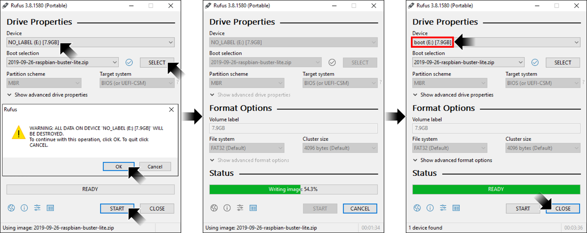
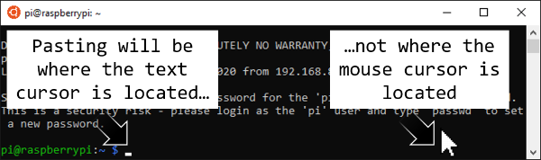

# [atet](https://github.com/atet) / [learn](https://github.com/atet/learn) / [**_raspberrypi_**](https://github.com/atet/learn/tree/master/raspberrypi)

[](#nolink)

# Introduction to Raspberry Pi

* Estimated time to completion: 30 minutes.
* This quick introduction to Raspberry Pi is meant to cover only the absolute necessary material to get you up and running in a minimal amount of time.
* You are here because **you want to learn IT skills while experiencing a realistic use case for using Raspberry Pi** single board computers (SBC).
* We will be using <a href="https://en.wikipedia.org/wiki/Bash_(Unix_shell)" target="_blank">Bash Command Line Interface (CLI)</a> to perform basic operations; advanced material is not covered here.

--------------------------------------------------------------------------------------------------

## Table of Contents

### Introduction

* [0. Requirements](#0-requirements)
* [1. _Game_ Plan](#1-game-plan)
* [2. Installation](#2-installation)
* [3. Connection](#3-connection)
* [4. Setup](#4-setup)
* [5. Craft Server](#5-craft-server)
* [6. Craft Client](#6-craft-client)
* [7. Next Steps](#7-next-steps)

### Supplemental

* [Using Command Line Interface](#using-command-line-interface)
* [Why Raspberry Pi?](#why-raspberry-pi)
* [Other Resources](#other-resources)
* [Troubleshooting](#troubleshooting)
* [Acknowledgments](#acknowledgments)

--------------------------------------------------------------------------------------------------

## 0. Requirements

### Software

* This tutorial was developed with Bash on Microsoft Windows 10 with Windows Subsystem for Linux (WSL) using Ubuntu 18.04 LTS
* If you are using MacOS, [your Terminal program is Bash](https://en.wikipedia.org/wiki/Terminal_(macOS))
* Most Linux distributions use or can use Bash

### Hardware

[](#nolink)

* This tutorial **requires the Raspberry Pi Zero W** ("wireless") which can be purchased from as little at $5-10 (computer only), additionally need:
   * 5V microUSB phone charger
   * MicroSD card (≥8 GB)

### WiFi Network

**The Pi Zero W is WiFi ready but requires very specific WiFi settings**

1. You must be able to connect a new wireless device to your WiFi network with only the network name (a.k.a. SSID) and network password
   * Some networks may require additional registration for new devices, like a school or public WiFi
   * The network can be hidden
2. The wireless network must have disabled [**"wireless isolation"** (a.k.a AP isolation, station isolation, or client isolation)](https://www.howtogeek.com/179089/lock-down-your-wi-fi-network-with-your-routers-wireless-isolation-option/)

[Back to Top](#table-of-contents)

--------------------------------------------------------------------------------------------------

## 1. _Game_ Plan

* Let's do something fun and setup a [Craft (free, open-source Minecraft clone)](https://www.michaelfogleman.com/projects/craft/) server to host multiple players at the same time
* Several different skills are introduced in this mini project:
   1. Basic IT: Formatting disks and installing operating systems
   2. Networking: Local area networking and secure shell access
   3. System Administration: Command line interface, building from source code, and running a server

[](#nolink)

[Back to Top](#table-of-contents)

--------------------------------------------------------------------------------------------------

## 2. Installation

### 2.1. Download Operating System: Raspbian Linux

* We will use a command line interface (CLI)-only Linux operating system
* There is no graphical user interface (GUI) like Microsoft Windows has; your interaction with the Raspberry Pi will be completely through text commands
* Download the latest Raspbian **Lite** image from: [https://www.raspberrypi.org/downloads/raspbian/](https://www.raspberrypi.org/downloads/raspbian/)

[](#nolink)

### 2.2. Prepare Micro SD Card

**This is the only step that can be frustrating and may take a few retries**

1. Clear everything off the SD card; delete all partitions
   * Windows: Use `diskpart` or Disk Management
2. Reformat the card
   * Windows `diskpart`: Deleting partitions here does not reformat the SD card
   * Windows Disk Management: Creating a new simple disk here will also reformat the SD card
3. Burn the Raspbian image onto the formatted micro SD card
   * I used Rufus Portable v3.8: [https://rufus.ie/](https://rufus.ie/)
   * If you do not format the SD card **before** this step, you may not be able to read the SD card as the `boot` drive
   * When the image burn is complete, just cancel out of Rufus

[](#nolink)

4. Access the new `boot` drive
   * **If you cannot read the card**; repeat steps 1-3
   * Show file name extensions

[](#nolink)

   * Make a new file called `ssh` (no file extension)
   * Make a new file called `wpa_supplicant.conf`

[](#nolink)

5. `wpa_supplicant.conf` settings
   * Open `wpa_supplicant.conf` with Notepad
   * Copy and paste the following, changing `<NETWORK NAME>` and `<NETWORK PASSWORD>` to match your network's and save
      * If your WiFi network is hidden, you must use the line `scan_ssid=1`

```
ctrl_interface=DIR=/var/run/wpa_supplicant GROUP=netdev
update_config=1
country=US

network={
   ssid="<NETWORK NAME>"
   scan_ssid=1
   psk="<NETWORK PASSWORD>"
   key_mgmt=WPA-PSK
}
```

[](#nolink)

6. Headless OS installation
   * **Headless** means that we will not have a monitor or keyboard attached to the Raspberry Pi Zero W and all administration of it will be remotely through command line interface (CLI)
   1. The Pi should not be powered on at this time
   2. Insert micro SD card
   3. Plug the micro USB power into the power port and the green LED should start blinking
   4. Wait for ~10 minutes while the Raspbian OS installs, configures itself, and automatically connects to your WiFi network; when it is done, the green LED should stop blinking and stay on

[Back to Top](#table-of-contents)

--------------------------------------------------------------------------------------------------

## 3. Connection

### 3.1. Determining your headless Raspberry Pi's IP address

**This may be tricky depending on your unique situation; I will describe three scenarios in which you can find this information**

1. You have administrative access to your local network's router
   * Log into the router and determine the IP address that corresponds to the `raspberrypi` hostname (default name configured for your Raspberry Pi Zero W)
2. You **do not** have access to your network's router but have USB and HDMI adapters
   * You need an HDMI compatible TV or monitor
   * Adapters for micro USB (Male) to USB-A (Female) and Mini HDMI (Male) to HDMI (Female)

   [](#nolink)

   * Login as username `pi` and password `raspberry`
   * Execute `ifconfig` and determine Pi's IP address

   ```
   $ ifconfig

   <EXAMPLE OUTPUT OF PI's ifconfig>
   ```

3. You **do not** have access to your network's router or adapters
   * You can connect to you Raspberry Pi through USB: [https://www.tomshardware.com/reviews/raspberry-pi-headless-setup-how-to,6028.html](https://www.tomshardware.com/reviews/raspberry-pi-headless-setup-how-to,6028.html)
   * You have to scan your network for all IP addresses: [https://www.raspberrypi.org/documentation/remote-access/ip-address.md](https://www.raspberrypi.org/documentation/remote-access/ip-address.md)

### 3.2. Remote connection to Raspberry Pi

**If you need an intro to Bash first, please see [Using Command Line Interface](#using-command-line-interface)**

* Once the green LED remains solid, the Pi should be ready for remote connection
* We will use Bash secure shell (SSH) through the WSL command line interface
* The default username is `pi` and password is `raspberry`

```
$ ssh pi@<IP ADDRESS>

<SHOW EXAMPLE OF LOGIN MOTD>
```

**If you successfully log in, CONGRATS! all the hard work is now done**

[Back to Top](#table-of-contents)

--------------------------------------------------------------------------------------------------

## 4. Setup

1. After logging in, we need to make a change to a location where the Pi will look for updates
   * Uncomment (remove '#' in front of): `deb-src http://raspbian...`
   * Press `CTRL+O` then `ENTER` to save
   * Press `CTRL+X` to exit

```
$ sudo nano /etc/apt/sources.list
```

2. Next, we need to update everything on the Pi and install a couple new dependencies (this will take 10+ mins., coffee break):

```
$ sudo apt-get update && \
  sudo apt-get -y upgrade && \
  sudo apt-get -y install git python-pip cmake libglew-dev xorg-dev libcurl4-openssl-dev && \
  sudo apt-get -y build-dep glfw && \
  python -m pip install requests
```

[Back to Top](#table-of-contents)

--------------------------------------------------------------------------------------------------

## 5. Craft Server

1. Download the files for running a Craft server from GitHub (~15 MB)

$ cd ~ && \
  git clone https://github.com/fogleman/Craft.git && \
  cd ~/Craft && \
  cmake .

2. If there are no obvious errors, we can build the program to run on the specific Raspberry Pi Zero W hardware (this will take ~10 mins., coffee break #2)

```
$ make && \
  gcc -std=c99 -O3 -fPIC -shared -o world -I src -I deps/noise deps/noise/noise.c src/world.c
```

3. Start server
   * The server hosts a persistent, shared world for users (clients) to connect to and play
   * Remember the IP address for the Pi, that is the address that clients will connect to
   * Once you run the line below, the server will display log output as events happen in the game world (players connecting, logging out, etc.)
   * You can stop the server by pressing `CTRL+C`

```
$ python server.py
```


[Back to Top](#table-of-contents)

--------------------------------------------------------------------------------------------------

## 6. Craft Client

### 6.1. Registering an account

* Even if we roll our own sever here, we need to register an account at the author's website to make changes in the multiplayer world: https://craft.michaelfogleman.com/

> "Why register?
>
> You can play on most game servers anonymously. **However, without registering you will not be able to make changes in most areas of the world**. After you are registered, game server admins can grant you various types of permissions."

* After you register and verify you email address, log back into https://craft.michaelfogleman.com/ and make an Identity Token, it should look like this:

```
/identity <USERNAME> 0123456789abcdef0123456789abcdef
```

* **Highlight the line and CTRL+C** (pressing the copy to clipboard didn't work for me to paste in the game)
   * NOTE: You can only see and copy this key once, when you close the window or logout, you will have to make another key

[](#nolink)

### 6.2. Download Craft client

* Download the Craft client for Windows or MacOS here: https://www.michaelfogleman.com/projects/craft/
* This is a "portable" program; nothing needs to be installed, just extract the ZIP file
* Run `craft.exe`
* Once the game starts, press "T" and CTRL+V to paste in your Identity Token and press ENTER
* Press "T" and enter `/online <SERVER IP>` to connect to your server
   * Once on the server, you should automatically be connected as your account
   * If it says you are a "guest", you must re-login: `/login <USERNAME>`

[](#nolink)

### 6.3 Playing Craft

* Controls are as follows:

Button | Action
--- | ---
`W`, `A`, `S`, `D` | Movement
Left-Mouse | Destroy block
Right-Mouse | Create block
Mouse-Wheel | Cycle through block types
CTRL+Right-Mouse | Create light source
`T` | Chat
`/` | Command: Chat but with `/` added
ESCAPE | Mouse control back to OS (to close or maximize/minimize Craft window)
More controls | https://github.com/fogleman/Craft#controls

[Back to Top](#table-of-contents)

--------------------------------------------------------------------------------------------------

## 7. Next Steps

[](#nolink)

* Have other people join in at you home network!
* Learn how to make cloud instances and share your server to the world
   * WARNING: You should learn how to "harden" your server security first before exposing your resources to the general public: [https://www.upguard.com/blog/10-essential-steps-for-configuring-a-new-server](https://www.upguard.com/blog/10-essential-steps-for-configuring-a-new-server)

**We touched on a bunch of basic to advanced IT tasks here; learn**

[Back to Top](#table-of-contents)

--------------------------------------------------------------------------------------------------

## Using Command Line Interface

### Windows 10

* Windows Subsystem for Linux (WSL) is a fully supported Microsoft product for Windows 10, learn how to install it here: [https://docs.microsoft.com/en-us/windows/wsl/install-win10](https://docs.microsoft.com/en-us/windows/wsl/install-win10)
* Please choose Ubuntu 18.04 LTS as the distribution you use with WSL
* WSL is only available for Windows 10

### MacOS

* You do not need to install anything, [your Terminal program is Bash](https://en.wikipedia.org/wiki/Terminal_(macOS))

### Linux

* I recommend using Ubuntu 18.04 LTS

### What is Bash?

* Bash is a command line interface (CLI) that allows you to use your operating system purely by text commands 
   * This is a huge benefit over clicking buttons in a graphical user interface **especially if you have a ton of repetitive and routine tasks**
* If you're a Windows user like I am, _unlike DOS Command Prompt that is tied to Microsoft_, Windows Subsystem for Linux finally allows some cross-compatibility with Linux and MacOS

### WARNING: CLI is very powerful

* With great power comes great responsibility; be vigilant of code you run so accidents don't happen
* If this is your first experience with using a command line interface, don't be intimidated, this is worth learning

### Welcome to CLI

* Before we dive into regular expressions, let's go over some basic commands to get around in Bash
* When you first start your command line interface (CLI), you'll typically be greeted with something similar to this:

```
atet:LAPTOP:~$ _
```
* For the sake of this tutorial, type out any commands you see after the `$` in the examples below

### Navigation

* If you're accustomed to using a graphical user interface (GUI) file explorer, just continue to think of your files and folders (a.k.a. "directories") in a tree-like structure

[](#nolink)

* If you execute the command `pwd` ("print working directory"), you'll see where you are currently in your file system

```
atet@LAPTOP:~$ pwd
/home/atet
```

* We can see what files are in your current working directory by executing `ls` ("list")

```
atet@LAPTOP:~$ ls
book.txt  new  song.mp3
```

* If you need more information about your files, you can add the flag `-l` to see more detail

```
atet@LAPTOP:~$ ls -l
total 0
-rw-rw-rw- 1 mba mba    0 Dec 21 18:39 book.txt
drwxrwxrwx 1 mba mba 4096 Dec 21 18:42 new
-rw-rw-rw- 1 mba mba    0 Dec 21 18:39 song.mp3
```

* A lot of information, but in this example we see that the file `new` is actually a directory (look all the way to the left and you see the `d`)
* If you have directories you want to navigate in and out of, you can use `cd <DIRECTORY NAME>` ("change directory") to go in and `cd ..` to go out

```
atet@LAPTOP:~$ cd new
atet@LAPTOP:~/new$ cd ..
atet@LAPTOP:~$
```

### File Management

* We only need to know four commands for file management this tutorial
* To make a new directory, use `mkdir <NEW NAME>` ("make directory")

```
atet@LAPTOP:~$ mkdir folder
atet@LAPTOP:~$ cd folder
atet@LAPTOP:~/folder$
```

* We will download an example files from my GitHub to work on, let's download one now with the program `wget`

```
atet@LAPTOP:~/folder$ wget https://raw.githubusercontent.com/atet/learn/master/regex/data/jane.txt

<A BUNCH OF WGET STATUS TEXT>

atet@LAPTOP:~/folder$ ls
jane.txt
```

* This is a short file, so we can peek at **all** the text contents using the program `cat` (don't use `cat` on big files, use `head` or `tail`)

```
atet@LAPTOP:~/folder$ cat jane.txt
Andrew_WK_-_Party_Hard.mp4
Beethoven_-_Fur_Elise.m4a
Beethoven_-_Symphony_No_6.mp3
Eddie_Murphy_-_Party_All_the_Time.mp3
LMFAO_-_Party_Rock_Anthem.mp4
Miley_Cyrus_-_Party_In_The_USA.mp4
Rick_Astley_-_Never_Gonna_Give_You_Up.m4a
```

* Let's **permanently delete** this file for now with `rm` ("remove")
   * WARNING: There will be no confirmation to delete files nor is there a concept of "recycling bin" here, be very careful with `rm`

```
atet@LAPTOP:~/folder$ ls
jane.txt
atet@LAPTOP:~/folder$ rm jane.txt
atet@LAPTOP:~/folder$ ls
atet@LAPTOP:~/folder$ _
```

[Back to Top](#table-of-contents)

--------------------------------------------------------------------------------------------------

## Why Raspberry Pi?

* **_Trust me on this one_**: There's a huge difference in your experience of learning something when the brand has sold 10+ million computers vs. a less-known (cheaper?) alternative that has only thousands of customers
* With a larger userbase, bugs get fixed quicker, there's reliable community and official support, you can expect timely updates, etc.
* The Raspberry Pi Zero is relatively inexpensive but is not going to host the next Twitter; this brand has other more powerful and more expensive computers if you need the horsepower

> [](#nolink)
>
> Raspberry Pi 4 Model B

[Back to Top](#table-of-contents)

--------------------------------------------------------------------------------------------------

## Other Resources

Description | Link
--- | ---
Official Raspberry Pi Help | https://www.raspberrypi.org/help/
Official Craft Server Installation | [https://github.com/fogleman/Craft#linux-ubuntu](https://github.com/fogleman/Craft#linux-ubuntu)

[Back to Top](#table-of-contents)

--------------------------------------------------------------------------------------------------

## Troubleshooting

Issue | Solution
--- | ---
I dont see the `boot` folder after I burn the OS image to the micro SD card | You needed to have formatted the card (to have a partition) BEFORE burning the Raspbian image to the card
I reformatted the SD card and the free space is **less** than before | You may be limited due to an existing small partition; erase all partitions before formatting
I cannot find my Pi's IP address | _Did your Pi successfully connect to your WiFi network?_ You may have to go back and verify `wpa_supplicant.conf` or confirm you can have new devices connect to your network

[Back to Top](#table-of-contents)

--------------------------------------------------------------------------------------------------

## Acknowledgments

1. newsCorpora.tsv is modified from NewsAggregatorDataset.zip: <a href="http://archive.ics.uci.edu/ml/datasets/News+Aggregator" target="_blank">Dua, D. and Graff, C. (2019). UCI Machine Learning Repository [http://archive.ics.uci.edu/ml]. Irvine, CA: University of California, School of Information and Computer Science.</a>

[Back to Top](#table-of-contents)

--------------------------------------------------------------------------------------------------

<p align="center">Copyright © 2019-∞ Athit Kao, <a href="http://www.athitkao.com/tos.html" target="_blank">Terms and Conditions</a></p>