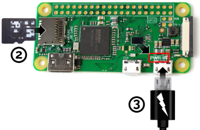
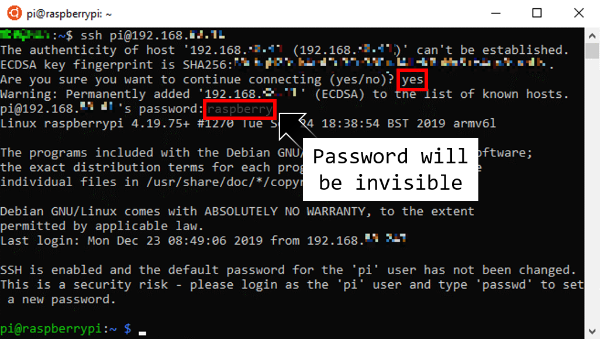
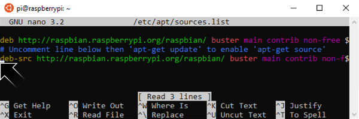
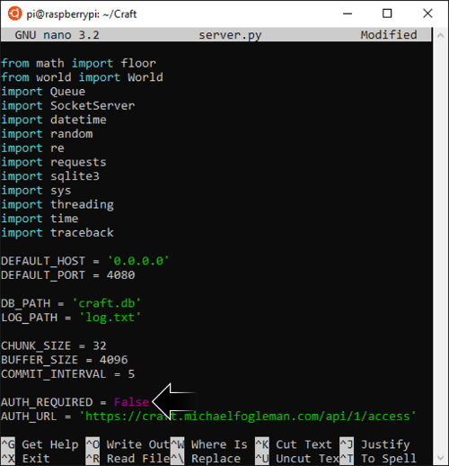
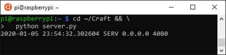
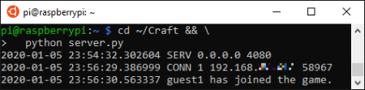
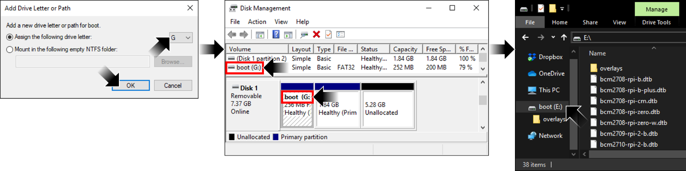

# [atet](https://github.com/atet) / [**_raspberrypi_**](https://github.com/atet/raspberrypi?tab=readme-ov-file#atet--raspberrypi)

[](#nolink)

# Introduction to Raspberry Pi

**Estimated time to completion: 15 minutes**<br>(excludes waiting times for downloads, updates, etc.)

* This introduction to Raspberry Pi only covers what's absolutely necessary to get you up and running
* You are here because **you want to experience a realistic use case for inexpensive single board computers (SBC) while learning fundamental IT skills**
* We will be using the $10 Raspberry Pi Zero W and command line interface (CLI)

--------------------------------------------------------------------------------------------------

## Table of Contents

### Introduction

* [0. Requirements](#0-requirements)
* [1. _Game_ Plan](#1-game-plan)
* [2. Installation](#2-installation)
* [3. Connection](#3-connection)
* [4. Updating](#4-updating)
* [5. Craft Server](#5-craft-server)
* [6. Craft Client](#6-craft-client)
* [7. Next Steps](#7-next-steps)

### Supplemental

* [Why Raspberry Pi?](#why-raspberry-pi)
* [Other Resources](#other-resources)
* [Troubleshooting](#troubleshooting)
* [DEFUNCT: Registering a Craft Account](#defunct-registering-a-craft-account)
* [Acknowledgments](#acknowledgments)

--------------------------------------------------------------------------------------------------

## 0. Requirements

**You don't need prior Command Line Interface (CLI) experience for this tutorial**

### Software

We will use a Linux a CLI available on all major operating systems

#### Windows 10

* Windows Subsystem for Linux (WSL) is a fully supported Microsoft product for Windows 10, learn how to install it here: https://github.com/atet/wsl

#### MacOS

* You do not need to install anything, [your Terminal program is Bash](https://en.wikipedia.org/wiki/Terminal_(macOS))

#### Linux

* I recommend using Ubuntu 20.04 LTS

### Hardware

* This tutorial uses the $10 Raspberry Pi Zero W ("wireless") computer
   * You will also need:
   1. Cell phone charger (5V) with micro USB cable
   2. MicroSD card (≥8 GB)
* NOTE: The older model Raspberry Pi Zero (without the "W") **does not include WiFi capability required for this tutorial**

> [](#nolink)
> 
> [Raspberry Pi Zero W, a $10 single board computer (SBC)](https://www.raspberrypi.org/products/raspberry-pi-zero-w/)

### WiFi Network

**The Raspberry Pi Zero W has specific WiFi requirements:**

* 2.4 GHz b/g/n WiFi-only
   * 5 GHz will not work with this model of Raspberry Pi
   * This network can be hidden
* Connect to WiFi using only the network name (a.k.a. SSID) and password
   * Some networks may require additional registration for new devices, like a school or public hotspot; consult your IT department about adding your Pi
* Disabled ["wireless isolation" (a.k.a. AP isolation, station isolation, or client isolation)](https://www.howtogeek.com/179089/lock-down-your-wi-fi-network-with-your-routers-wireless-isolation-option/)
   * **You will not be able to connect to your Pi through WiFi** if this is not disabled on your network

**Once you have everything here, you're ready to go!**

[Back to Top](#table-of-contents)

--------------------------------------------------------------------------------------------------

## 1. _Game_ Plan

* Let's do something fun and setup a Craft<sup>[[1]](#acknowledgments)</sup> server to host multiplayer games
* Several different skills are introduced in this short tutorial:
   1. Basic IT: Formatting disks and installing operating systems
   2. Networking: Local area networking and secure shell access
   3. System Administration: Command line interface, building from source code, and running a server

> [](#nolink)
> 
> Messing around in Craft on single player mode

[Back to Top](#table-of-contents)

--------------------------------------------------------------------------------------------------

## 2. Installation

### 2.1. Download Operating System Image

* Download the latest **Raspbian Linux Lite** image from: [https://www.raspberrypi.org/downloads/raspbian/](https://www.raspberrypi.org/downloads/raspbian/)
   * Make sure you download the "Lite" version
   * You do not need to extract the ZIP file

[](#nolink)

### 2.2. Burn OS Image on Micro SD Card

* Download and run Rufus Portable v3.8: [https://rufus.ie/](https://rufus.ie/)
* Select your micro SD card as the device
* Choose the Raspbian ZIP image and `START` the burn
   * Coffee Break: This will take ~10 mins and you don't need to babysit
* **You must confirm the new drive is named "`boot`" (red box below) once complete**
   * If not, see: [Mounting `boot` Drive in Windows Disk Management](#mounting-boot-drive-in-windows-disk-management)
* You can just `CLOSE` Rufus when done

[](#nolink)

### 2.3. Access New `boot` Drive

**If you cannot read the SD card, see:** [**Mounting `boot` Drive in Windows Disk Management**](#mounting-boot-drive-in-windows-disk-management)

#### 2.3.1. Show file name extensions

* File name extensions must be visible for this next part
* Click on the "View" tab, then "Show/hide" button, then enable "File name extensions"

[](#nolink)

#### 2.3.2. Make two new configuration files

* Make a new file called "`ssh`" (without a file extension)
   * Windows will give a warning, just choose "Yes"
   * This file will remain empty
* Make another new file called "`wpa_supplicant.conf`"

[](#nolink)

#### 2.3.3. `wpa_supplicant.conf` settings

* Open "`wpa_supplicant.conf`" with Notepad (right-click → Open with → Choose another app → Notepad)

[](#nolink)

```
ctrl_interface=DIR=/var/run/wpa_supplicant GROUP=netdev
update_config=1
country=US

network={
   ssid="My Apartment 2.4Ghz"
   scan_ssid=1
   psk="password123"
   key_mgmt=WPA-PSK
}
```

**`wpa_supplicant.conf` file**

* Copy and paste the above, changing "`ssid`" and "`psk`" to match your network's name and password and save
* **If your WiFi network is hidden**, you must use the line "`scan_ssid=1`"

**After you add these two files, safely eject your prepared micro SD card**

### 2.4. Headless OS installation

**Headless** means that we won't attach a monitor or keyboard to the Pi and all communication to it will be through command line interface (CLI) from another computer

1. The Pi should not be powered on at this time
2. Insert the prepared micro SD card into the Pi

[](#nolink)

3. Plug the micro USB power into the Pi's power port ("`PWR IN`") and the green LED should start blinking
   * Coffee Break #2: This will take ~10 mins as the Pi automatically installs the Raspbian OS and connects to your WiFi network; you don't need to babysit
4. When the Pi is ready, the green LED should stop blinking and stay on

[Back to Top](#table-of-contents)

--------------------------------------------------------------------------------------------------

## 3. Connection

**IMPORTANT: The only thing you need to know about CLI for this tutorial is that copy/paste is really odd in terminal:**

* Copy from outside of terminal (e.g. webpage) to paste in terminal: 
   * Copy: Highlight text and right-click+Copy or CTRL+C
   * Paste: Move text cursor (not mouse pointer) to where you want to paste and right-click

[](#nolink)

* Copy from within terminal to paste in terminal:
   * Copy: Highlight text and right-click
   * Paste: Move text cursor (not mouse pointer) to where you want to paste and right-click
* Copy from within terminal to paste outside of terminal (e.g. Notepad):
   * Copy: Highlight text and right-click
   * Paste: Right-click+Paste or CTRL+V

**Troubleshooting: If nothing or the wrong text is pasting, try to copy and paste again**

### 3.1. Determining the IP address of your headless Raspberry Pi

* Press the Windows key and search for "command" and open **Command Prompt**
* In Command Prompt, execute "`ping -f raspberrypi.local`"
   * This operation will not work in WSL Bash, only Windows Command Prompt
* This will give you the **IP address** that the Pi connected as (write this down):

[](#nolink)

* If this method to get the IP address fails or you are not using Windows, see: [Advanced Connection Methods for Headless Raspberry Pi](#advanced-connection-methods-for-headless-raspberry-pi)

### 3.2. Remote connection to Raspberry Pi

* Press the Windows key and search for "ubuntu" and open **Ubuntu 18.04 LTS**
* In Ubuntu Bash, execute "`ssh pi@<PI'S IP ADDRESS>`"
   * You may get a warning of "`The authenticity of host...`", just answer "`yes`"
   * If you get "`WARNING: REMOTE HOST IDENTIFICATION...`", just follow the directions given
* Use the default password "`raspberry`" and press Enter
   * Typing the password will be invisible for security

[](#nolink)

**After you successfully log in and see "`pi@raspberrypi:~ $ _`", all the hard work is now done**

[](#nolink)

[Back to Top](#table-of-contents)

--------------------------------------------------------------------------------------------------

## 4. Updating

### 4.1. Add update source

* After logging in, we need to add a location where the Pi will look for updates
* Copy and paste the command after the "`$`" and press ENTER:

```
$ sudo nano /etc/apt/sources.list
```

* Remove "`#`" in front of: "`deb-src http://raspbian...`"
   * Press `CTRL+O` then `ENTER` to save file
   * Press `CTRL+X` to exit this text editor

[](#nolink)

* After changing the above file, run "`sudo apt update`"
* The command should run successfully like this:

```
pi@raspberrypi:~ $ sudo apt update
Get:1 http://raspbian.raspberrypi.org/raspbian buster InRelease [15.0 kB]
Get:2 http://archive.raspberrypi.org/debian buster InRelease [25.2 kB]
Get:3 http://raspbian.raspberrypi.org/raspbian buster/rpi Sources [1,132 B]
Get:4 http://raspbian.raspberrypi.org/raspbian buster/contrib Sources [78.5 kB]
Get:5 http://archive.raspberrypi.org/debian buster/main armhf Packages [260 kB]
Get:6 http://raspbian.raspberrypi.org/raspbian buster/non-free Sources [139 kB]
Get:7 http://raspbian.raspberrypi.org/raspbian buster/main Sources [11.4 MB]
Get:8 http://raspbian.raspberrypi.org/raspbian buster/main armhf Packages [13.0 MB]
Fetched 24.9 MB in 56s (441 kB/s)
Reading package lists... Done
Building dependency tree
Reading state information... Done
64 packages can be upgraded. Run 'apt list --upgradable' to see them.
pi@raspberrypi:~ $ _
```

* **IMPORTANT**: You must rerun "`sudo apt update`" if you see any issues like:

   ```
   1: Network is unreachable) [IP: 93.93.128.193 80]
   E: Unable to fetch some archives, maybe run apt-get update or try with --fix-missing?
   pi@raspberrypi:~ $ _
   ```

* If this error keeps occuring, the update servers may be having issues; try again later
* **This command must run successfully before continuing this tutorial**

[Back to Top](#table-of-contents)

--------------------------------------------------------------------------------------------------

## 5. Craft Server

### 5.1. Download Craft server dependencies

* We need to install a few new programs that the Craft server program is dependent on (a.k.a. dependencies)
* Copy and paste the entire multi-line command after the "`$`" and press ENTER:
   * Coffee break #3: This will take ~15 mins. and you don't need to babysit this

```
$ sudo apt install -y git python-pip cmake libglew-dev \
  xorg-dev libcurl4-openssl-dev && \
  sudo apt -y build-dep glfw && \
  python -m pip install requests
```

* **IMPORTANT**: If there are issues in the next few steps, you may have to re-run each line from above one-by-one and confirm they executed successfully:

   ```
   $ sudo apt update
   $ sudo apt install -y git python-pip cmake libglew-dev \
     xorg-dev libcurl4-openssl-dev
   $ sudo apt -y build-dep glfw
   $ python -m pip install requests
   ```

### 5.2. Download Craft server program

* Download the files for running a Craft server from GitHub:

```
$ cd ~ && \
  git clone https://github.com/fogleman/Craft.git
```

### 5.3. Build Craft server program

* Build the Craft program to run on the Raspberry Pi Zero W
   * Coffee break #4: This will take ~15 mins. and you don't need to babysit this
   * There may be some warnings, but the program should build correctly if everything from step 4.2. was successful
   * **IMPORTANT**: If you don't see the terminal going back to "pi@raspberrypi:~/Craft $ _" the screen may be "stuck", just click on the terminal and press Enter a couple times

```
$ cd ~/Craft && \
  cmake . && \
  make && \
  gcc -std=c99 -O3 -fPIC -shared -o world -I src -I \
  deps/noise deps/noise/noise.c src/world.c
```

### 5.4. Modify Craft server program

* Modify the following file to allow clients to build in the multiplayer world:

```
$ cd ~/Craft && nano server.py
```

* Change line 25 from "`True`" to "`False`"
   * Press `CTRL+O` then `ENTER` to save file
   * Press `CTRL+X` to exit this text editor

[](#nolink)

### 5.5. Start Craft server program

* The Craft server program must be actively running to host a multiplayer world for users (clients) to log into
* The server program will start running when you execute the line below and **initially look blank** (no text cursor)

```
$ cd ~/Craft && \
  python server.py
```

[](#nolink)


* Events will only display as they happen in the game world (players connecting, players logging out, etc.)

[](#nolink)

* Remember the IP address for the Pi from step 3.1: **This IP is the address that clients will connect to**
* With the Craft server program running, move on to the next section

[Back to Top](#table-of-contents)

--------------------------------------------------------------------------------------------------

## 6. Craft Client

### 6.1. Download Craft client program

* Download and extract the ZIP file of the Craft client for Windows or MacOS here: https://www.michaelfogleman.com/projects/craft/
* Run `craft.exe`

### 6.2. Connecting to Craft server

**Recall the IP address that you used to connect to your Pi server from step 3.1**

* Once the game starts, bring up the in-game console by pressing "`T`"
* Enter "`/online <PI'S IP ADDRESS>`" to connect to your Craft multiplayer server

[](#nolink)

### 6.3. Playing Craft

**CONGRATS! You're done with the tutorial**

* Have fun and build a whole new world in your own Craft playground:

Button | Action
--- | ---
`W`, `A`, `S`, `D` | Movement (Up, Left, Down, Right)
`Left-Mouse` | Destroy block
`Right-Mouse` | Create block
`Mouse-Wheel` | Cycle through block types
`CTRL`+`Right-Mouse` | Create light source
`T` | Chat
`/` | Command: Chat but with `/` added
`ESC` | Mouse control back to OS (to close or maximize/minimize Craft window)
More controls | https://github.com/fogleman/Craft#controls

### 6.4. Multiplayer vs. single-player

* **The only way to have multiplayer in Craft is to connect to a server that is actively running the Craft server program**

[](#nolink)


* **Switch back to single-player mode from multiplayer** by pressing "`T`" and entering "`/offline`"
* Other players will not be able to connect to your single-player mode world

### 6.5. Cleanup

**After you are done with this tutorial:**

* You can continue to have the server program run as long as you want to play on it
* You can shut down the server program by pressing `CTRL+C`, then shut down the Pi by executing:

```
$ sudo shutdown -h now
```

* **To start the Pi back up after shutdown**: Physically remove the micro USB power cable from the Pi, wait a few seconds, then plug it back in

[Back to Top](#table-of-contents)

--------------------------------------------------------------------------------------------------

## 7. Next Steps

**We touched on a bunch of different IT tasks here; you're easily on your way to becoming a self-sufficient ["techie"](https://www.merriam-webster.com/dictionary/techie), it just takes a lot of experimenting and completing projects like this**

* Try this tutorial one more time to solidify these concepts
* Have other people join in at your home local area network (LAN)
* **I highly recommend continuing with another mini project: [Atet's 15 Minute Introduction to Network Attached Storage](https://github.com/atet/nas?tab=readme-ov-file#atet--nas)**
* Make cloud instances and share your Craft server to the world!
   * WARNING: You must secure your server before exposing it to the public internet: [https://www.upguard.com/blog/10-essential-steps-for-configuring-a-new-server](https://www.upguard.com/blog/10-essential-steps-for-configuring-a-new-server)

[Back to Top](#table-of-contents)

--------------------------------------------------------------------------------------------------

## Why Raspberry Pi?

* **_Trust me on this one_**: There's a huge difference in your learning experience when the brand you're working with has sold 10+ million computers vs. lesser-known alternatives that may be a _bit_ cheaper
* With a larger userbase, there's reliable community and official support, bugs get fixed quicker, you can expect timely updates, etc.
* The Raspberry Pi Zero is amazing for its price point, [but it's not going to play Crysis](https://en.wikipedia.org/wiki/Crysis_(video_game)#Legacy); this brand has other more powerful and more expensive computers if you need the horsepower

> [](#nolink)
>
> Raspberry Pi 4 Model B

[Back to Top](#table-of-contents)

--------------------------------------------------------------------------------------------------

## Other Resources

Description | Link
--- | ---
Official Raspberry Pi Help | https://www.raspberrypi.org/help/
Official Craft Server Installation | https://github.com/fogleman/Craft#linux-ubuntu
Official Raspberry Pi Getting Started Guide | https://projects.raspberrypi.org/en/pathways/getting-started-with-raspberry-pi
Official Raspberry Pi Project Ideas | https://projects.raspberrypi.org/en/

[Back to Top](#table-of-contents)

--------------------------------------------------------------------------------------------------

## Troubleshooting

Issue | Solution
--- | ---
I don't need a password to use my WiFi | If you administer your own "open" network that does not require a password, **you should secure your network ASAP**: [https://lifehacker.com/how-to-make-your-wifi-router-as-secure-as-possible-1827695547](https://lifehacker.com/how-to-make-your-wifi-router-as-secure-as-possible-1827695547)
Cannot access micro SD card `boot` drive after OS image burn | Mount the newly created "`boot`" drive in Windows Disk Management, instructions here: [Mounting `boot` Drive in Windows Disk Management](#mounting-boot-drive-in-windows-disk-management)
Reformatted micro SD card's free space is **less** than before | Multiple partitions may exist on card from a previous OS burn; proceed to burn image with Rufus again and Rufus will automatically erase all partitions on the SD card
Cannot find Pi's IP address | _Did the Pi actually connect to your WiFi network successfully?_ Go back and verify `wpa_supplicant.conf` or confirm you have permission to connect new devices to your network<br><br>You can also verify connection status and the assigned IP address by connecting to the Pi _locally_: [Advanced Connection Methods for Headless Raspberry Pi](#advanced-connection-methods-for-headless-raspberry-pi)
`Permission denied` while attempting to log into Pi | Make sure you login as the user "`pi`", i.e. "`ssh pi@<PI'S IP ADDRESS>`"
`WARNING: REMOTE HOST IDENTIFICATION...` | This means another computer had this same IP address; if this is not an issue, follow the directions given on-screen
The wrong text is pasting in terminal | Copying and pasting into terminal is an art: Once you copy something, you must make sure you don't accidentally copy something else in the terminal before you right-click paste (e.g. blank space, different text, etc.)
`git` will not download the Craft files | `git` will not download files if there is already a directory with the name "`Craft`", if you previously performed the `git` step and needed to redo it, you must first delete the existing "`Craft`" directory with:<br><br>`$ rm -rf ~/Craft`
Building seems to be frozen or hanging | Click on the terminal and press Enter a couple times, if that doesn't work, you may have to wait a while longer
Craft client crashes/closes when attempting to log into multiplayer server | Craft server program must be running on the Raspberry Pi server; confirm correct IP address typed and try again
Player camera slowly looks up automatically | Bug when game is maximized to fullscreen; just play windowed if this happens or rebuild from scratch: https://github.com/fogleman/Craft/issues?utf8=%E2%9C%93&q=cursor
"`Only logged in users are allowed to build`": Cannot make changes to multiplayer world | In order to make changes to your multiplayer world, you must register for a free Craft account on the author's website, see: [DEFUNCT: Registering a Craft Account](#defunct-registering-a-craft-account)

### **Mounting `boot` Drive in Windows Disk Management**

* If you **don't** see "`boot`" as name given to your freshly burned SD card (red box below), you will not be able to access it for step [2.3. Access New `boot` Drive](#23-access-new-boot-drive)
1. `CLOSE` Rufus
2. **IMPORTANT**: Physically remove your SD card from your computer, wait a few seconds, then reinsert
   * **Press "Cancel"** when Windows prompts you to reformat the card

[](#nolink)

3. Press the Windows key and search for "disk management"
4. Click on "Create and format hard disk partitions" which will open the Windows Disk Management program
5. In the bottom windows pane, find your micro SD card
6. Right-click on the "`boot`" partition and select "Change Drive Letter and Paths..."
7. In the popup window, click on "`Add`"

[](#nolink)

8. Another popup window will appear and Windows will automatically select a drive letter that is unused (yours may be a different letter)
9. Press "`OK`" and Windows will mount your SD card's "`boot`" partition (red boxes below)
10. You can now open this "`boot`" drive in Windows File Explorer and continue with step [2.3. Access New `boot` Drive](#23-access-new-boot-drive)

[](#nolink)

### **Advanced Connection Methods for Headless Raspberry Pi**

#### If you have administrative access to your local network's router:
   * Log into the router and determine the IP address that corresponds to the hostname `raspberrypi` (default name for your Pi)
   * Below is an example router administration page to look up the IP addresses associated with connected devices

   [](#nolink)

#### If you **do not** have admin access to your network's router, you can try:
   * Scanning your network for connected IP addresses with Angry IP Scanner: https://stackoverflow.com/a/23432113
      * You will need Java Runtime Environment for the Angry IP Scanner program: https://www.java.com/en/download/win10.jsp

      [](#nolink)

   * Connecting as `pi@raspberrypi.local` using Apple Bonjour service: https://raspberrypi.stackexchange.com/a/45199
      * Download Bonjour Print Services for Windows v2.0.2: https://support.apple.com/kb/DL999?locale=en_US

#### Connecting via USB cable

* You will need the USB charging cable
* https://www.tomshardware.com/reviews/raspberry-pi-headless-setup-how-to,6028.html

#### Connecting locally

If you **do not** have access to your network's router but have USB and HDMI adapters:
   * You need an HDMI compatible TV or monitor
   * Adapters for micro USB (Male) to USB-A (Female) and Mini HDMI (Male) to HDMI (Female)

   [](#nolink)

   * Connect a USB keyboard and HDMI monitor to the Pi using the adapters
   * Login as default username `pi` and password `raspberry`
   * Execute `ifconfig` and determine Pi's IP address
      * Look under the `wlan0` section
      * Find the IP address after `inet`
      * If the Pi did not successfully connect to your network, there will not be an IP address shown

   [](#nolink)

[Back to Top](#table-of-contents)

--------------------------------------------------------------------------------------------------

## DEFUNCT: Registering a Craft Account

**We have bypassed this requirement by modifying the `server.py` file in step [5.4. Modify Craft server program](#54-modify-craft-server-program)**

* **NOTICE: You cannot register a new Craft account at this time (Jan. 1, 2020)**
* You can still still log onto your server as a "guest"
* Even though we made our own sever here, we still need to register an account on the creator of Craft's website: https://craft.michaelfogleman.com/

> "Why register?
>
> You can play on most game servers anonymously. **However, without registering you will not be able to make changes in most areas of the world**."

* After you register and verify your email address, log back into https://craft.michaelfogleman.com/ and make an Identity Token, it should look similar to:

```
/identity <USERNAME> 0123456789abcdef0123456789abcdef
```

[](#nolink)

* **Highlight the line and `CTRL`+`C`** (pressing the copy to clipboard button didn't work for me to paste in the game)
* NOTE: You can only see this key once; if you close this window, you will have to make another key if you need it again

### Connecting to Craft server

* Once the game starts, press "`T`" and `CTRL`+`V` to paste in your Identity Token and press ENTER (slash "`/`" in front is used to denote system commands)
* Press "`T`" and enter "`/online <SERVER IP>`" to connect to your Raspberry Pi Zero Craft server
   * Once on the server, you should automatically be connected as your account (only if you have registered an account prior to January 1, 2020)
   * The server may accidentally log you off your username after you connect; if it says you are a "guest", you must re-login: "`/login <USERNAME>`"

[](#nolink)

[Back to Top](#table-of-contents)

--------------------------------------------------------------------------------------------------

## Acknowledgments

1. Craft, the free, open-source Minecraft clone by Michael Fogleman: <a href="https://www.michaelfogleman.com/projects/craft/" target="_blank">https://www.michaelfogleman.com/projects/craft/</a>

[Back to Top](#table-of-contents)

--------------------------------------------------------------------------------------------------

<p align="center">Copyright © 2019-∞ Athit Kao, <a href="http://www.athitkao.com/tos.html" target="_blank">Terms and Conditions</a></p>